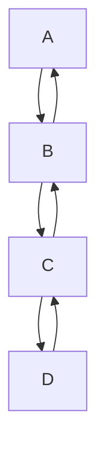

# KiPaD

## Overview
KiPaD is a python script that allows you to determine the observed rate constants and spectroscopic properties of intermediate species, from data obtained from multiwavelength time-resolved absorption spectroscopy using stopped-flow.

## Usage
This software is created in Google Colab. To access it, click on the Google Colab badge above or on this [link](https://colab.research.google.com/github/unizar-flav/KiPaD/blob/master/KiPaD_8.ipynb).

**Step 1**: Verify the format of the data. It must be a CSV file and with the following structure:

| SPECTRA   |  |  |  |  |  |
| -------   | ------- | ------- | ------- | ------- | ---- |
|    |  $\lambda_1$  |  $\lambda_2$ | $\lambda_2$ |$\lambda_2$ | ... |
| $t_1$ | 0.0002    | 0.0002     |  0.0002    |  0.0002    | ... |
| $t_2$ | 0.0002    | 0.0004     | 0.0031     | 0.0034     | ...   |
| $t_3$ | 0.0001    | 0.0004     | 0.0029     | 0.0034     | ...   |
| $t_4$ | 0.0002    | 0.0002     | 0.0027     | 0.0032     | ...   |
| ...    | ...   | ...    | ...   | ...   | ...   |

Here:
* **$\lambda_n$**: Wavelength values, in nm , listed in increasing order.
* **$t_m$**: Time points, also listed in increasing order.

**Step 2**: Load the modules and functions *(Modules and functions)*. This step only needs to be perform once regardless of the number of datasets processed.

**Step 3**: Run the next cell *(Upload files)*. It supports multiple files provided they have distinct time-points $t_m$. For example:
1. A file with time-points that ranges from 0.01 to 0.1 s in increments of 0.01 s.
2. A file with time-points that ranges from 1 to 100 s in increments of 1s.
3. A file with a single time-point at 0.00s.
The function *lee_espectro()* will merge the files into a single DataFrame sorting the data by time-points in ascending order.

**Step 4**: The following cell *(Spectra plot)* will plot two 2D plots: Absorbance vs Wavelength and Absorbance vs Time. The plots will be displayed in tabs with their respective titles, and they are interactive, allowing zooming via box zoom or wheel zoom. Users can also download the plots as PNG files

**Step 5**: In this cell *(Singular Value Determination (SVD) and Identification of the Significant Singular Values (SSV))* performs SVD and the identifies SSV using three methods:
1. **Scree-plot method**: Plots the singular values on a Cartesian plane and identifies the "elbow" point as the number of SSV. This implementation uses a numerical definition of the elbow, selecting the SSV at which the singular values up to the point they no longer fit a line with a regression coeffiecient greater of equal to a threshold (default:*scree_plot_th* to 0.9).
2. **Entropy Method**: Evaluates the data's uncertainty explain by singular valies. By selectinf a threshold (from 0 to 1, default: *entropy_threshold* to 0.9), the method identifies the smallest number of singular values needed to exceed this level, ensuring the specified uncertainty is explained.
3. **Broken-Stick Method**: compares the singular values to a random "broken stick" distribution. SSVs are identified as those exceeding the corresponding values from this distribution, indicating significant components in the data.

Each method prints the number of SSVs determined. These values can be interepreted as the number of significant "absorbers" (species with spectroscopic properties), providing insight into the potential number of reaction species under study.

**Step 6**:In the next cell *(Dimensionality reduction and Matrix Approximation)*, you will be prompted to input the number of SSVs, based on the results from Step 5. The script will then approximate the original data using only the significant singular values, which represent the primary variations in the dataset, effectively reducing noise. and then it will perform an approximation of original data using only the significant singular values, which capture the primary variations in the data, effectively reducing noise.

**Step 7**: This step repeats Step 4 but uses the *denoised* data. The resulting plots demonstrate the denoised data, with smoother lines reflecting reduced noise.

**Step 8**: The next cell *(Reaction Model Parameters)*, allows you to input the relevant parameters for the proposed reaction model :
- **Number of species**: Corresponding to the number of SSVs.
- **Pathlength of the cuvette**: The pathlength used in the experiment.
- **Initial concentration of the species**: Initial concentrations for each species in the model.
- **Estimated kinetic rates**: Provide estimates for kinetic rates. For parameters to be optimized during fitting, uncheck the *k_fixed* box.
This script currently is only able to handle this reaction model (or simpler versions of it):

**Step 9**: This cell *(Procesa)* runs the *procesa()* function which performs the optimization of the proposed reaction model proposed. A dropdown menu allows you to select the method for estimating spectroscopic species:
* **Pseudo-inverse Method**: Recommended if you have a rough estimation of the kinetic parameters.
* **Explicit Method**: Use this if no prior information about kinetic parameters is available. Then use the optimized 

**Step 10**: This cell *(Model's plots)* will plot the modeled data:
- **Absorbance vs Wavelength**
- **Absorbance vs Time**
- **Concentratration Profile**
- **Spectroscopic Species**
- **Residual Plots:**
    - **Absorbance vs Wavelength (Original Data)**: Residuals calculated using original data.
    - **Absorbance vs Wavelength (Denoised Data)**: Residuals calculated using denoised data.
    - **Absorbance vs Time (Original Data)**: Residuals calculated using original data.
    - **Absorbance vs Time (Denoised Data)**: Residuals calculated using denoised data.

**Step 11**: The final cell *(Export results)* will gather all the generated data and save it as a set of CSV files within a ZIP archive. List of data:
1. Original experimental data
2. Denoised experimental data
3. Model data
4. Residuals (Denoised - Model data)
5. Residuals (Original - Model data)
6. Concentration profile
7. Spectroscopic species
8. Initial parameters along with the fitting result from procesa
