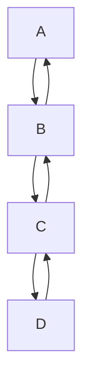

# KiPaD

## Overview
KiPaD is a python script that allows you to determine the observed rate constants and spectroscopic properties of intermediate species, from data obtained from multiwavelength time-resolved absorption spectroscopy using stopped-flow.

## Usage
This software is created in Google Colab. To access it, click on the Google Colab badge above or on this [link](https://colab.research.google.com/github/unizar-flav/KiPaD/blob/master/KiPaD_8.ipynb).

**Step 1**: Check the format of the data, it must be a csv file and have the following structure:

| SPECTRA   |  |  |  |  |  |
| -------   | ------- | ------- | ------- | ------- | ---- |
|    |  $\lambda_1$  |  $\lambda_2$ | $\lambda_2$ |$\lambda_2$ | ... |
| $t_1$ | 0.0002    | 0.0002     |  0.0002    |  0.0002    | ... |
| $t_2$ | 0.0002    | 0.0004     | 0.0031     | 0.0034     | ...   |
| $t_3$ | 0.0001    | 0.0004     | 0.0029     | 0.0034     | ...   |
| $t_4$ | 0.0002    | 0.0002     | 0.0027     | 0.0032     | ...   |
| ...    | ...   | ...    | ...   | ...   | ...   |

where $\lambda_n$ and $t_m$ are the wavelength and the times in increasing order, respectively.

**Step 2**: Load the modules and functions *(Modules and functions)*. This step only needs to be perform once regardless of the number of datasets processed.

**Step 3**: Run the next cell *(Upload files)*. It is prepared to handle more than one file, but they must have different $\t_m$. For example:
1. A file with time-points that ranges from 0.01 to 0.1 s in increments of 0.01 s.
2. A file with time-points that ranges from 1 to 100 s in increments of 1s.
3. A file with a single time-point at 0.00s.
The program *lee_espectro()* will combine all three files into a single DataFrame and order the data acording to the time-points in increasing order.

**Step 4**: The following cell *(Spectra plot)* will plot two 2D plots: Absorbance vs Wavelength and Absorbance vs Time. The plots will be displays in tabs with their respective names and the plot themsleves are interactive as they allow to zoom in or out through box zoom and wheel zoom. It also has the option to download the plot as a png file.

**Step 5**: In this cell *(Singular Value Determination (SVD) and Determination of the Significant Singular Values (SSV))* we perform SVD and the determination of SSV through three different methods:
1. *Scree-plot method*: This method is based in drawing the singular values in a Cartesian coordinate system and then the number of singular values is chosen as the "elbow" of the graph. The particular application in this code includes a numerical definition of the "elbow", as the SSV at which the points no longer properly fit a line with a regression coefficient equal or bigger to a set threshold (default: *scree_plot_th=0.9*). Those singular values are thus considered as the most important to explain the data and, therefore, named Significant Singular Values (SSVs).
2.  *Entropy method*: This approach evaluates the uncertainty in the data that the singular values can explain. A threshold is set to determine the desired level of explain uncertainty. For instance, if you aim to capture 90% of the data's uncertainty, you set *entropy_threshold* to 0.9. The method then identifies the smallest number of singular values *(n)* need to exceed this threshold, ensuring the specified level of uncertainty is explained.
3. *Broken-stick method*: It determines the number of SSVs by comparing them to a random distribution. It generates a "broken stick" distribution and identifies how many singular values of the data exceed the values of this distribution. The number of of singular values greater than the broken stick values indicates the significant components in the data.

After running the cell each method will print the number of SSV they determined. Be mindful that the number of SSV can be considered as the number of relevant *absorbers* (species with spectroscopic properties) and thus the number of possible species in the reaction in study.

**Step 6**: In the next cell *(Dimensionality reduction and Matrix Approximation)*, it will ask you to input the number of SSVs (take into account the results from the previous step) and then it will perform an approximation of original data using only those singular values, which are responsible of the main variations of the data and thus elminitaing noise from the data.

**Step 7**: Repeat of step 4 but with the *denoised* data. Here it can be appreciated the lines are much smoother.

**Step 8**: The next cell *(Reaction Model Parameters)*, allows you to input the relevant parameters for the reaction model proposed:
- Number of species (related to number of SSV)
- Pathlength of the cuvette
- Initial concentration of the species
- Estimated kinetic rates (for those to be optimzed the *k_fixed* box must be unchecked)
This script currently is only able to handle this reaction model or simpler versions of it:

**Step 9**: The following cell *(Procesa)* will call the procesa function which will be in charge on the optimization of the reaction model proposed. There is a dropdown which allows to choose the method by which the spectroscopic species are estimated. If you have a rough estimation of the kinetic parameters the *Pseudo-inverse* method is the best choice, if you do not have any information you may use the *Explicit* method.

**Step 10**: This cell *(Model's plots)* will plot the modeled data:
- Absorbance vs Wavelength
- Absorbance vs Time
- Concentratration Profile
- Spectroscopic Species
- Absorbance vs Wavelength Residuals Plot (uses the original data to calculate the residuals)
- Absorbance vs Wavelength Residuals Denoised Plot (uses the denoised data to calculate the residuals)
- Absorbance vs Time Residuals Plot (uses the original data to calculate the residuals)
- Absorbance vs Time Residuals Denoised Plot (uses the denoised data to calculate the residuals)

**Step 11**: The final cell *(Export results)* will gather all the generated data and save it as a set of CSV files within a ZIP archive. List of data:
1. Original experimental data
2. Denoised experimental data
3. Model data
4. Residuals (Denoised - Model data)
5. Residuals (Original - Model data)
6. Concentration profile
7. Spectroscopic species
8. Initial parameters along with the fitting result from procesa
